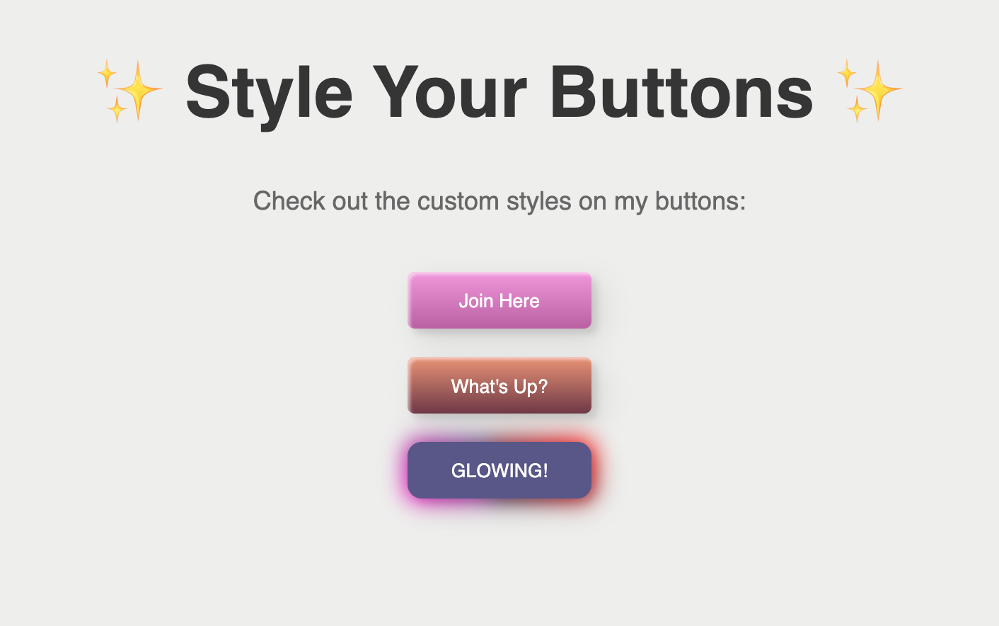

# [SDF04] CSS Magic Buttons

Get ready to create animated buttons using CSS! This project focuses on creating three unique animated buttons using CSS. With this challenge, you'll dive into the world of CSS animations, transitions, and interactivity.

## Learning Goals

By completing this project, you will learn to:

- Design engaging button animations with CSS.
- Master the use of CSS transitions and animations for interactive effects.

## Project Overview

### Time Estimate: 2 hours

## What you Need to Do:

1. **Starter Code**: Clone the starter code from GitHub for your project. The HTML structure is provided, and you'll focus on adding styles in the `style.css` file.

- Starter code can be found here: https://github.com/CodeSpace-Academy/Module_4_StudentNo_Classcode_Group_Name-Surname_SDF04

2. **Write your CSS Styles**: Create your animations from scratch. You're welcome to go through our curated buttons for inspiration: [View Reference](https://codepen.io/codespace-academy/pen/xxmWrjX).

3. **Prepare Your Repository**:

   - Save all chanes and update your GitHub repository with the final versions of all files.
   - Include a `README.md` file that outlines the project, your design choices, and any notes on challenges you faced or features you're particularly proud of.
   - Ensure your repository is set to public so it can be accessed by your code coach.

4. **Submit on LMS**:
   - Submit the link to your GitHub repository on the LMS under the SDF04 project tab.

Embark on this CSS journey to transform simple buttons into interactive, animated elements. Let your creativity shine and enjoy the process of bringing static elements to life!

## Submission Guidelines

- Submit the link to your GitHub repository on the LMS under the SDF04 project tab.

Embark on this CSS journey to transform simple buttons into interactive, animated elements. Let your creativity shine and enjoy the process of bringing static elements to life!

--- 

## Project Outline
### My Design Choices:

I wanted to indicate my level of understanding in terms of what I've learned by showcasing different levels to each button, ranging from beginner to immtermediate and then advanced. 
- **BUTTON 1** is inspired by one of the reference buttons that reflects a simple hover effect that changes color when hovering on the button, along with a linear-gradient effect that displays 2 different colors when you hover on the button.
- **BUTTON 2** is also inspired by one of the reference buttons that reflects a transparent background while outlining the border when hovering on the button.
- **BUTTON 3** reflects a more advanced understanding of animations. Although, I haven't added any hovering effect as the button only infinitely glows in the background, it adds a colorful attraction to the button itself which may easily attract the attention of a user.

### Challenges:

I initially codepened the reference buttons, commenting out the css properties to reflect the changes to better understand what is happening. Most of what you learn in the coursework is pretty much specific so when you have the starter code, it's a bit tricky distinguishing changes that is already there. 

I had fun figuring out which colors to use for the buttons, although it took some time to get the colors that I feel is user-friendly and eay-catching. Playing around with hex and rgb code can be tricky and confusing at first but you get the hang of it once you understand how it's being applied.

I particularly like the glowing button.
